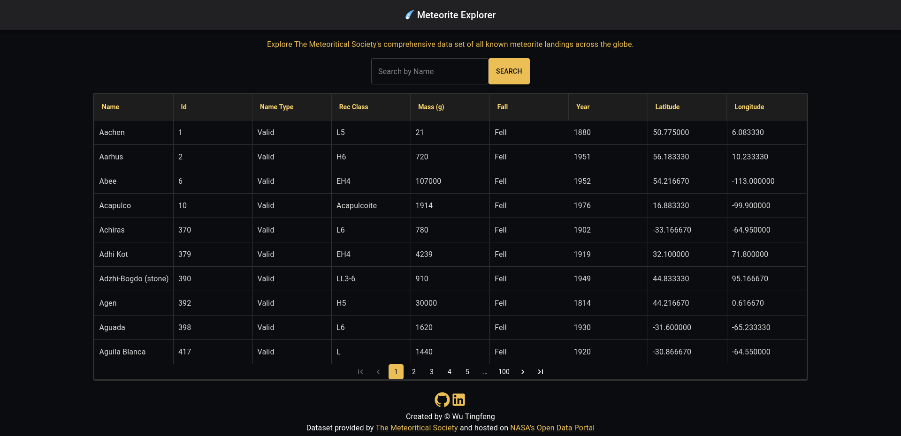

# Meteorite Explorer




## Overview

This single-page application was created as a pre-requisite solo-project for the Voyage 36 of the Chingu remote learning Programme. It pulls data from [NASA's Meteorite Landing dataset](https://data.nasa.gov/Space-Science/Meteorite-Landings/gh4g-9sfh)

Live Link: https://meteorite-explorer.vercel.app

## Features

- [x] The data is sorted according to name and displayed on a table
- [x] Search results are separated into pages
- [x] A search field allows for filtering of meteorites by _Name_
- [x] Search field displays a dropdown with the last 10 search terms
- [x] 3 mobile-friendly ways to search: 1) Press _Search_ button 2) Press _Enter_ key 3) _Select_ previously-searched term from dropdown menu
- [x] Display appropriate error notifications if API GET request fails or takes too long (more than 5 seconds).
- [x] For fun: Text-scrambling effect on page load and meteor shower loading animation

## Setup instructions

`git clone` and `cd` into the project directory

Then run the following

```bash
# NPM users
npm install
npm run start

# Yarn users
yarn install
yarn start
```

## Useful guides

- https://www.aleksandrhovhannisyan.com/blog/format-code-on-save-vs-code-eslint

- https://mui.com/components/data-grid/

- https://redux-toolkit.js.org/
